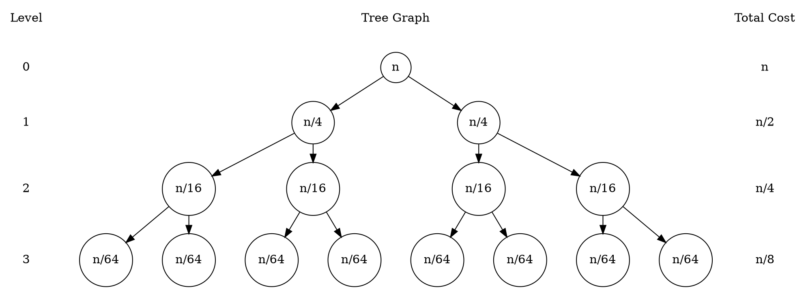
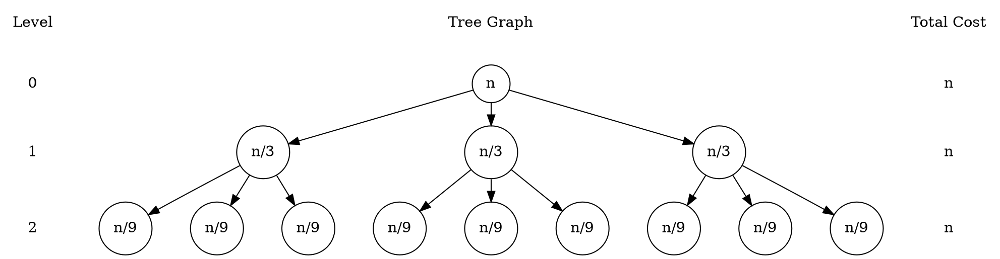

```dot
digraph PerfectBinaryTree {
    node [shape=circle];
    graph [nodesep=0.5, ranksep=0.4];

    // ===== HEADER =====
    LevelHdr [label="Level", shape=plaintext];
    TreeHdr [label="Tree Graph", shape=plaintext];
    CostHdr  [label="Total Cost", shape=plaintext];

    // Level 0
    1 [label="n"];
    // Level 1
    2 [label="n/8"];
    3 [label="n/8"];
    4 [label="n/8"];
    5 [label="n/8"];
    // Level 2
    6 [label="n/4"];
    7 [label="n/4"];
    8 [label="n/4"];
    9 [label="n/4"];
    10 [label="n/4"];
    11 [label="n/4"];
    12 [label="n/4"];
    13 [label="n/4"];
    14 [label="n/4"];
    15 [label="n/4"];
    16 [label="n/4"];
    17 [label="n/4"];
    18 [label="n/4"];
    19 [label="n/4"];
    20 [label="n/4"];
    21 [label="n/4"];
    
    // edges
    TreeHdr -> 1 [style=invis];
    1 -> 2;
    1 -> 3;
    1 -> 4;
    1 -> 5;
    2 -> 6;
    2 -> 7;
    2 -> 8;
    2 -> 9;
    3 -> 10;
    3 -> 11;
    3 -> 12;
    3 -> 13;
    4 -> 14;
    4 -> 15;
    4 -> 16;
    4 -> 17;
    5 -> 18;
    5 -> 19;
    5 -> 20;
    5 -> 21;

    // Kolom kiri: level
    L0 [label="0", shape=plaintext];
    L1 [label="1", shape=plaintext];
    L2 [label="2", shape=plaintext];

    // Kolom kanan: total cost
    C0 [label="n", shape=plaintext];
    C1 [label="2n", shape=plaintext];
    C2 [label="4n", shape=plaintext];

    // Rank constraints
    { rank=same; LevelHdr; CostHdr}
    { rank=same; L0; 1; C0 }
    { rank=same; L1; 2; 3; 4; 5; C1 }
    { rank=same; L2; 6; 7; 8; 9; 10; 11; 12; 13; 14; 15; 16; 17; 18; 19; 20; 21 C2 }

    // Invisible edges supaya kolom rapi
    LevelHdr -> L0 [style=invis];
    L0 -> L1 -> L2 [style=invis];
    CostHdr -> C0 [style=invis];
    C0 -> C1 -> C2 [style=invis];
}
```

Analisis Algoritme - R2
Ghiffari Bravia Hisham (G6401231050)

## A. Metode Pohon Keputusan
### 1. ${T(n) = 2T(\frac n 4) + n}$

Diketahui
$$
a = 2, \; b = 4, \; f(n) = n
$$

Menentukan batas i
$$
2^i = n; \quad i = \log(n)
$$
Menentukan T(n)
$$
T(n) = S(n) = n + \frac n 2 + \frac n 4 + \frac n 8 + ...
$$
$$
T(n) = \sum_{i=0}^{\log n} (\frac 1 2)^i \; n
$$
$$
T(n) = n \sum_{i=0}^{\log n} (\frac 1 2)^i
$$
$$
T(n) = n(\frac {1} {1 - \frac 1 2})
$$
$$
T(n) = n(\frac {1} {\frac 1 2})
$$
$$
T(n) = 2n
$$
Menentukan Kompleksitas
$$
Kompleksitas = O(n)
$$

### 2. ${T(n) = 3T(\frac n 3) + n}$

Diketahui
$$
a = 3; \; b = 3; \; f(n) = n
$$

Menentukan batas i
$$
3^i = n; \quad i = \log_3(n)
$$
Menentukan T(n)
$$
T(n) = S(n) = n + n + n + {...}
$$
$$
T(n) = \sum_{i=0}^{\log_3(n)} n
$$
$$
T(n) = n(\log_3(n) + 1)
$$
Menentukan Kompleksitas
$$
Kompleksitas = O(n\log n)
$$

### 3. ${T(n) = 4T(\frac n 2) + n}$

Diketahui
$$
a = 4; \; b = 2; \; f(n) = n
$$

Menentukan batas i
$$
4^i = n; \quad i = \log_4(n)
$$
Menentukan T(n)
$$
T(n) = S(n) = n + 2n + 4n + {...}
$$
$$
T(n) = \sum_{i=0}^{\log_4(n)} (2)^i n
$$
$$
T(n) = n (\frac {2^{\log_4(n)} - 1}{2 - 1})
$$
$$
T(n) = n(\sqrt n - 1)
$$
Menentukan Kompleksitas
$$
Kompleksitas = O(n\sqrt n)
$$

### 4. ${T(n) = 7T(\frac n 8) + n}$

Diketahui
$$
a = 7; \; b = 8; \; f(n) = n
$$

