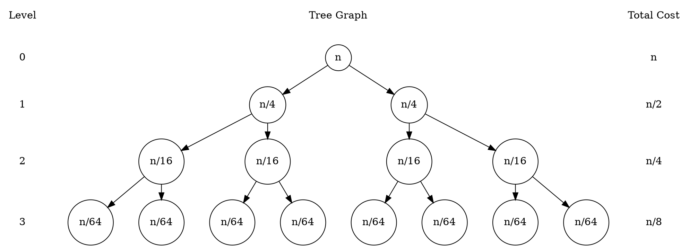
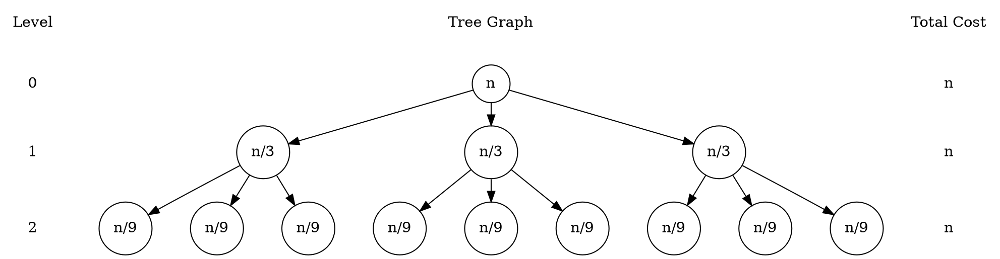

```dot
digraph PerfectBinaryTree {
    node [shape=circle];
    graph [nodesep=0.2, ranksep=0.8];

    // ===== HEADER =====
    LevelHdr [label="Level", shape=plaintext];
    TreeHdr [label="Tree Graph", shape=plaintext];
    CostHdr  [label="Total Cost", shape=plaintext];

    // Level 0
    1 [label="n"];
    
    // Level 1
    2 [label="n/8"];
    3 [label="n/8"];
    4 [label="n/8"];
    5 [label="n/8"];
    6 [label="n/8"];
    7 [label="n/8"];
    8 [label="n/8"];
    
    // Level 2
    9 [label="n/64"];
    10 [label="n/64"];
    11 [label="n/64"];
    12 [label="n/64"];
    13 [label="n/64"];
    14 [label="n/64"];
    15 [label="n/64"];
    
    16 [label="n/64"];
    17 [label="n/64"];
    18 [label="n/64"];
    19 [label="n/64"];
    20 [label="n/64"];
    21 [label="n/64"];
    22 [label="n/64"];
    
    23 [label="n/64"];
    24 [label="n/64"];
    25 [label="n/64"];
    26 [label="n/64"];
    27 [label="n/64"];
    28 [label="n/64"];
    29 [label="n/64"];
    
    30 [label="n/64"];
    31 [label="n/64"];
    32 [label="n/64"];
    33 [label="n/64"];
    34 [label="n/64"];
    35 [label="n/64"];
    36 [label="n/64"];
    
    37 [label="n/64"];
    38 [label="n/64"];
    39 [label="n/64"];
    40 [label="n/64"];
    41 [label="n/64"];
    42 [label="n/64"];
    43 [label="n/64"];
    
    44 [label="n/64"];
    45 [label="n/64"];
    46 [label="n/64"];
    47 [label="n/64"];
    48 [label="n/64"];
    49 [label="n/64"];
    50 [label="n/64"];
    
    51 [label="n/64"];
    52 [label="n/64"];
    53 [label="n/64"];
    54 [label="n/64"];
    55 [label="n/64"];
    56 [label="n/64"];
    57 [label="n/64"];
    
    // edges
    TreeHdr -> 1 [style=invis];
    1 -> 2;
    1 -> 3;
    1 -> 4;
    1 -> 5;
    1 -> 6;
    1 -> 7;
    1 -> 8;
    
    2 -> 9;
    2 -> 10;
    2 -> 11;
    2 -> 12;
    2 -> 13;
    2 -> 14;
    2 -> 15;
    
    3 -> 16;
    3 -> 17;
    3 -> 18;
    3 -> 19;
    3 -> 20;
    3 -> 21;
    3 -> 22;
    
    4 -> 23;
    4 -> 24;
    4 -> 25;
    4 -> 26;
    4 -> 27;
    4 -> 28;
    4 -> 29;
    
    5 -> 30;
    5 -> 31;
    5 -> 32;
    5 -> 33;
    5 -> 34;
    5 -> 35;
    5 -> 36;
    
    6 -> 37;
    6 -> 38;
    6 -> 39;
    6 -> 40;
    6 -> 41;
    6 -> 42;
    6 -> 43;
    
    7 -> 44;
    7 -> 45;
    7 -> 46;
    7 -> 47;
    7 -> 48;
    7 -> 49;
    7 -> 50;
    
    8 -> 51;
    8 -> 52;
    8 -> 53;
    8 -> 54;
    8 -> 55;
    8 -> 56;
    8 -> 57;
    


    // Kolom kiri: level
    L0 [label="0", shape=plaintext];
    L1 [label="1", shape=plaintext];
    L2 [label="2", shape=plaintext];

    // Kolom kanan: total cost
    C0 [label="n", shape=plaintext];
    C1 [label="7n/8", shape=plaintext];
    C2 [label="49n/64", shape=plaintext];

    // Rank constraints
    { rank=same; LevelHdr; CostHdr}
    { rank=same; L0; 1; C0 }
    { rank=same; L1; 2; 3; 4; 5; 6; 7; 8; C1 }
    { rank=same; L2; 9; 10; 11; 12; 13; 14; 15; 16; 17; 18; 19; 20; 21; 22; 23; 24; 25; 26; 27; 28; 29; 30; 31; 32; 33; 34; 35; 36; 37; 38; 39; 40; 41; 42; 43; 44; 45; 46; 47; 48; 49; 50; 51; 52; 53; 54; 55; 56; 57; C2 }

    // Invisible edges supaya kolom rapi
    LevelHdr -> L0 [style=invis];
    L0 -> L1 -> L2 [style=invis];
    CostHdr -> C0 [style=invis];
    C0 -> C1 -> C2 [style=invis];
}
```

Analisis Algoritme - R2 <br>Ghiffari Bravia Hisham (G6401231050)

### A. Metode Pohon Keputusan
#### 1. ${T(n) = 2T(\frac n 4) + n}$

Diketahui
$$
a = 2, \; b = 4, \; f(n) = n
$$


Menentukan batas i
$$
2^i = n; \quad i = \log(n)
$$
Menentukan T(n)
$$
T(n) = S(n) = n + \frac n 2 + \frac n 4 + \frac n 8 + ...
$$
$$
T(n) = \sum_{i=0}^{\log n} (\frac 1 2)^i \; n
$$
$$
T(n) = n \sum_{i=0}^{\log n} (\frac 1 2)^i
$$
$$
T(n) = n(\frac {1} {1 - \frac 1 2})
$$
$$
T(n) = n(\frac {1} {\frac 1 2})
$$
$$
T(n) = 2n
$$
Menentukan Kompleksitas
$$
Kompleksitas = O(n)
$$

#### 2. ${T(n) = 3T(\frac n 3) + n}$

Diketahui
$$
a = 3; \; b = 3; \; f(n) = n
$$


Menentukan batas i
$$
3^i = n; \quad i = \log_3(n)
$$
Menentukan T(n)
$$
T(n) = S(n) = n + n + n + {...}
$$
$$
T(n) = \sum_{i=0}^{\log_3(n)} n
$$
$$
T(n) = n(\log_3(n) + 1)
$$
Menentukan Kompleksitas
$$
Kompleksitas = O(n\log n)
$$

#### 3. ${T(n) = 4T(\frac n 2) + n}$

Diketahui
$$
a = 4; \; b = 2; \; f(n) = n
$$


Menentukan batas i
$$
4^i = n; \quad i = \log_4(n)
$$
Menentukan T(n)
$$
T(n) = S(n) = n + 2n + 4n + {...}
$$
$$
T(n) = \sum_{i=0}^{\log_4(n)} (2)^i n
$$
$$
T(n) = n (\frac {2^{\log_4(n)} - 1}{2 - 1})
$$
$$
T(n) = n(\sqrt n - 1)
$$
Menentukan Kompleksitas
$$
Kompleksitas = O(n\sqrt n)
$$

#### 4. ${T(n) = 7T(\frac n 8) + n}$

Diketahui
$$
a = 7; \; b = 8; \; f(n) = n
$$


Menentukan batas i
$$
7^i = n; \quad i = \log_7(n)
$$
Menentukan T(n)
$$
T(n) = S(n) = n + \frac {7n} 8 + \frac {49n} {64} + {...}
$$
$$
T(n) = \sum_{i=0}^{\log_7(n)} (\frac 7 8)^i \; n
$$
$$
T(n) = n(\frac {1} {1 - \frac 7 8})
$$
$$
T(n) = 8n
$$
Menentukan Kompleksitas
$$
Kompleksitas = O(n)
$$

### B. Metode Master Theorem

| No  |             T(n)             |  a  |  b  |    f(n)     |    ${n^{\log_b a}}$    | Kasus |   Kompleksitas    |
| :-: | :--------------------------: | :-: | :-: | :---------: | :--------------------: | :---: | :---------------: |
|  1  | ${2T(\frac n 2) + n\log n}$  |  2  |  2  | ${n\log n}$ |  ${n^{\log_2 2} = n}$  |   3   |  ${O(n\log n)}$   |
|  2  |    ${4T(\frac n 2) + n}$     |  4  |  2  |    ${n}$    | ${n^{\log_2 4} = n^2}$ |   1   |    ${O(n^2)}$     |
|  3  |   ${9T (\frac n 3) + n^2}$   |  9  |  3  |   ${n^2}$   | ${n^{\log_3 9} = n^2}$ |   2   | ${O(n^2\log(n))}$ |
|  4  | ${3T (\frac n 3) + n^{3/2}}$ |  3  |  3  | ${n^{3/2}}$ |  ${n^{\log_3 3} = n}$  |   3   |  ${O(n^{3/2})}$   |

### C. Analisis Kompleksitas Algoritme Analitis

#### C1. Algoritme TriMerge Sort

Algoritme ini berfungsi untuk mengurutkan array dengan membaginya rekursif menjadi tiga bagian berukuran ${n / 3}$, mengurutkan tiap bagian, lalu menggabungkan tiga array terurut tersebut secara linear.

```
PROCEDURE TRIMERGESORT(A, ℓ, r)
    if ℓ ≥ r then
        return
    n ← r - ℓ + 1
    m1 ← ℓ + ⌊n/3⌋ - 1
    m2 ← ℓ + ⌊2n/3⌋ - 1

    TRIMERGESORT(A, ℓ, m1)
    TRIMERGESORT(A, m1+1, m2)
    TRIMERGESORT(A, m2+1, r)

    MERGE3_IN_PLACE(A, ℓ, m1, m2, r)
END PROCEDURE
```

Bentuk Rekursi T(n)
$$
T(n) = 3T(\frac n 3) + n  
$$
Untuk setiap eksekusi, fungsi akan memanggil dirinya sendiri sebanyak tiga kali dengan parameter yang terbagi rata di ketiga fungsi tersebut. Pada penggabungan array, setidaknya akan ada sebanyak n-1 operasi perbandingan untuk setiap elemen pada saat pengurutan sehingga ${f(n) = n}$

Perhitungan O(n)

|             T(n)             |  a  |  b  | f(n)  |   ${n^{\log_b a}}$   | Kasus |  Kompleksitas  |
| :--------------------------: | :-: | :-: | :---: | :------------------: | :---: | :------------: |
| ${T(n) = 3T(\frac n 3) + n}$ |  3  |  3  | ${n}$ | ${n^{\log_3 3} = n}$ |   2   | ${O(n\log n)}$ |
#### C2. Algoritme QuadHist

Algoritme ini berfungsi untuk menghitung frekuensi nilai 1..K pada larik dengan membaginya rekursif menjadi empat sublarik dan menjumlahkan histogram dari tiap sublarik.

```
PROCEDURE QUADHISTOGRAM(A, ℓ, r, K)  // returns H[1..K]
    if ℓ > r then
        return ZERO_VEC(K)            // all zeros

    if ℓ = r then
        H ← ZERO_VEC(K)
        H[A[ℓ]] ← H[A[ℓ]] + 1
        return H

    n  ← r - ℓ + 1
    q1 ← ℓ + ⌊n/4⌋ - 1
    q2 ← ℓ + ⌊n/2⌋ - 1
    q3 ← ℓ + ⌊3n/4⌋ - 1

    H1 ← QUADHISTOGRAM(A, ℓ, q1, K)
    H2 ← QUADHISTOGRAM(A, q1+1, q2, K)
    H3 ← QUADHISTOGRAM(A, q2+1, q3, K)
    H4 ← QUADHISTOGRAM(A, q3+1, r, K)

    return ADD4(H1, H2, H3, H4)       // element-wise sum
END PROCEDURE
```

Bentuk Rekursi T(n)
$$
T(n) = 4T(\frac n 4) + n
$$
Untuk setiap eksekusi, fungsi akan memanggil dirinya sendiri sebanyak empat kali dengan parameter yang terbagi rata di keempat fungsi tersebut. Pada penggabungan array histogram, setidaknya akan ada sebanyak 3n operasi penjumlahan untuk setiap elemen pada array sehingga ${f(n) = n}$

Perhitungan O(n)

|             T(n)             |  a  |  b  | f(n)  |   ${n^{\log_b a}}$   | Kasus |  Kompleksitas  |
| :--------------------------: | :-: | :-: | :---: | :------------------: | :---: | :------------: |
| ${T(n) = 4T(\frac n 4) + n}$ |  4  |  4  | ${n}$ | ${n^{\log_4 4} = n}$ |   2   | ${O(n\log n)}$ |
